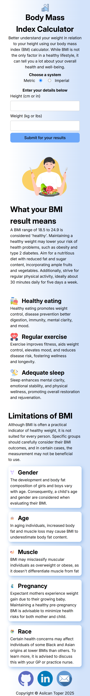
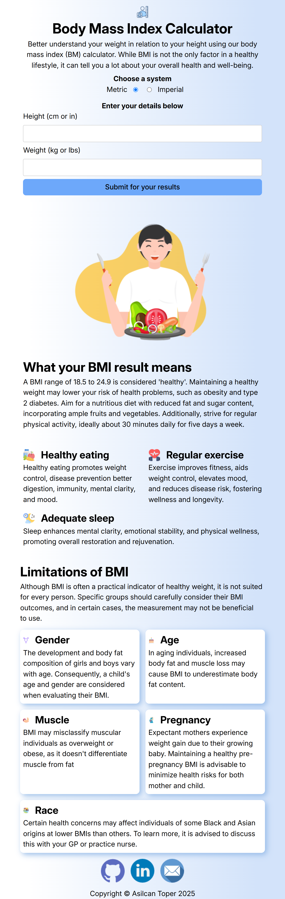
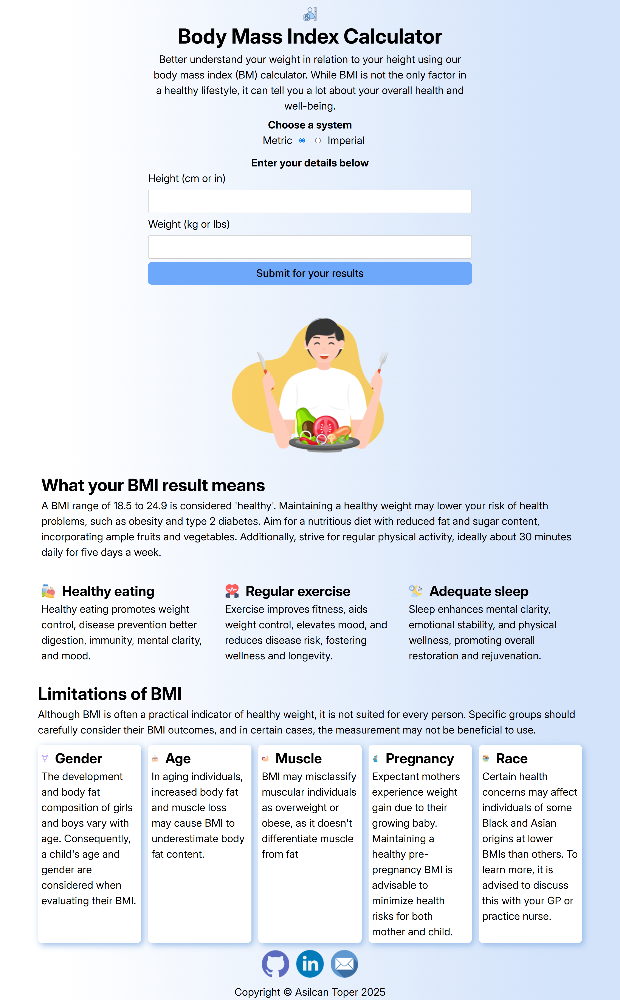

## Table of contents

- [Overview](#overview)
  - [The challenge](#the-challenge)
  - [Screenshots](#screenshots)
- [My process](#my-process)
  - [Built with](#built-with)
  - [What I learned](#what-i-learned)
  - [Useful resources](#useful-resources)
- [Installation](#Installation)
- [Author](#author)

## Overview

### The challenge

**Users should be able to:**

- Select whether they want to use metric or imperial units
- Enter their height and weight
- See their BMI result, with their weight classification and healthy weight range
- View the optimal layout for the interface depending on their device's screen size
- See hover and focus states for all interactive elements on the page

### Screenshots

|        Mobile (375px)         |        Tablet (768px)         |        Desktop (1440px)         |
| :---------------------------: | :---------------------------: | :-----------------------------: |
|  |  |  |

## My process

### Built with

- **Semantic HTML5** for better structure
- **React** for UI development
- **TypeScript** for type safety and better developer experience
- **Flexbox & CSS Grid** for layout
- **Mobile-first workflow** for responsiveness
- **Fluid typography** for scalable text sizes
- **Accessibility best practices**

### What I learned

- **What is BMI? How do you calculate it?**
  - [BMI Calculator](https://www.calculator.net/bmi-calculator.html)
  - [Body Mass Index (BMI)](https://my.clevelandclinic.org/health/articles/9464-body-mass-index-bmi)
  - [BMI Calculation Formula Explained](https://www.registerednursern.com/bmi-calculation-formula-explained/)
- **Container Query**
  - [Using container size and style queries](https://developer.mozilla.org/en-US/docs/Web/CSS/CSS_containment/Container_size_and_style_queries)
  - [CSS container queries](https://developer.mozilla.org/en-US/docs/Web/CSS/CSS_containment/Container_queries)
- **Section labels**
- [HTML section elements are a lie (sort of)](https://youtu.be/ULdkpU51hTQ?si=ofIPwN34HWvKUABL)

### Useful resources

- [Accessibility Developer Guide](https://www.accessibility-developer-guide.com/)
- [MDN Web Docs](https://developer.mozilla.org/en-US/docs/Web)
- [The Clamp Calculator](https://www.marcbacon.com/tools/clamp-calculator/)
- [The Modern JavaScript Tutorial](https://javascript.info/)
- [Wes Bos - JavaScript Introduction](https://wesbos.com/javascript/01-the-basics/welcome) and other [courses](https://wesbos.com/courses)

## Installation

To run this project locally, follow these steps:

1. **Clone the repository:**
   ```sh
   git clone https://github.com/KapteynUniverse/bmi-calculator.git
   cd bmi-calculator
   ```
2. **Install dependencies:**
   `npm install`
3. **Start the development server:**
   `npm run dev`

## Author

- Asilcan Toper - [Portfolio](https://asilcantoper.netlify.app/)
- Live Site URL: [bmi-calculator](https://kapteyn-bmi-calculator.netlify.app/)

- [Go to top](#overview)
